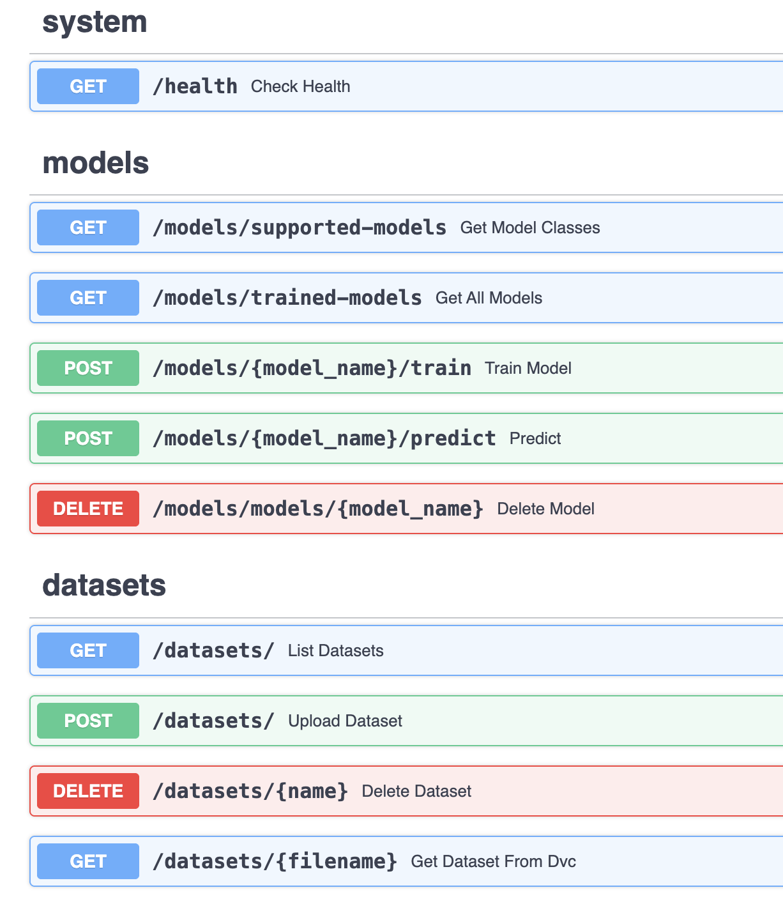
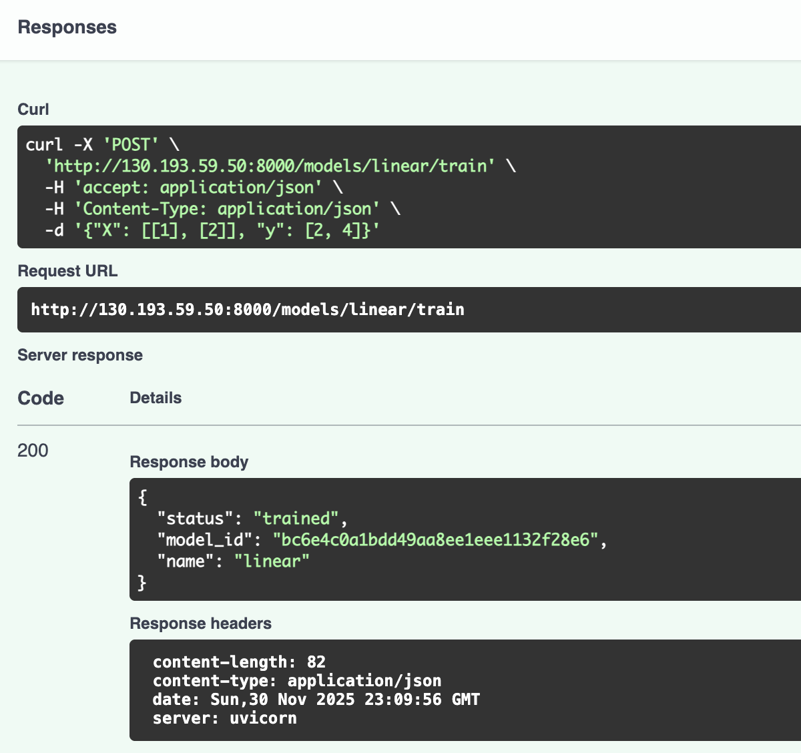
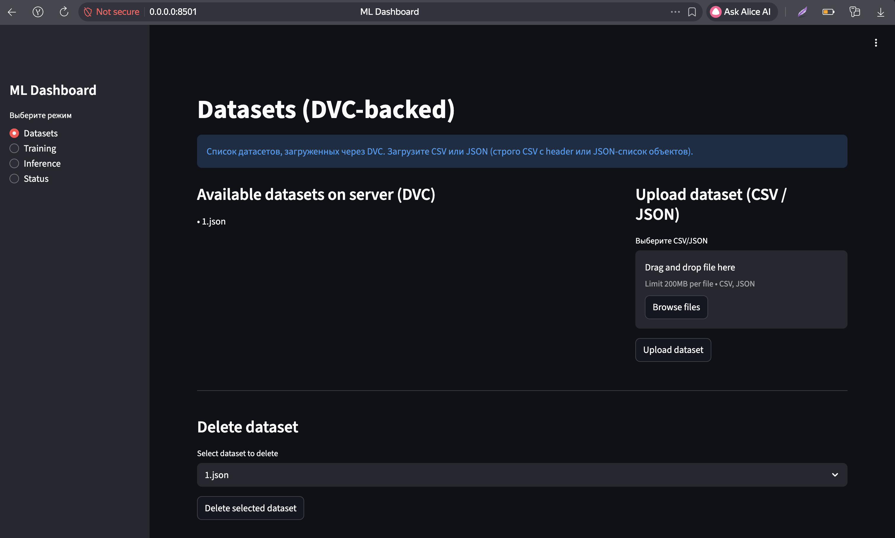
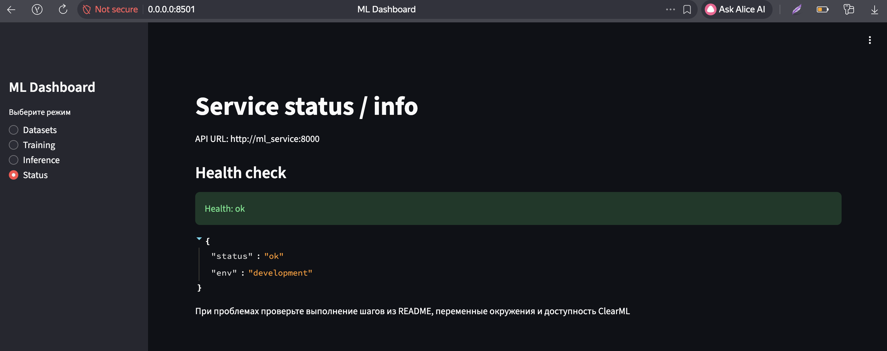

# ML Manager — проект

## Быстрый старт
1. Скопировать `.env.example` -> `.env` и заполнить переменные.

2. Перейти в корень проекта
```bash
cd ~/MlService
```
3. Запустить локально
```bash
make -f Makefile.local rebuild
```

Протестировать работоспособность можно по запросом по `curl http://0.0.0.0:8000/health`

Swagger доступен по `http://0.0.0.0:8000/docs`

Интерактивный дашборд доступен по `http://0.0.0.0:8501/`

Сервис работает с DVC и ClearMl. 

Для работы с ClearMl нужно:
1. После запуска сервиса залогиниться по `http://0.0.0.0:8080/login`
2. Перейти `Settings` -> `Workspace` -> Кликнуть `Create new credentials` -> Положить `Access key` и `Secret key` в .env в CLEARML_API_ACCESS_KEY и CLEARML_API_SECRET_KEY соответственно

Реализованное API


Пример запроса на обучение модели


Интерактивный дашборд




## Minikube

Поддержано развертывание в миникубе, для запуска нужно выполнить `make -f Makefile.minikube all`

Для проверки успешности можно вызвать `make -f Makefile.minikube open-api` или `make -f Makefile.minikube open-dashboard`