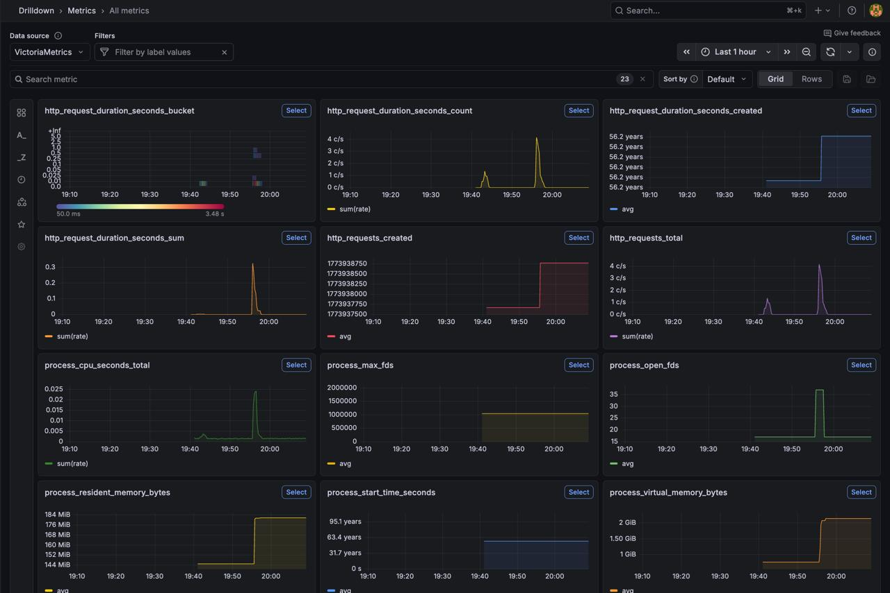
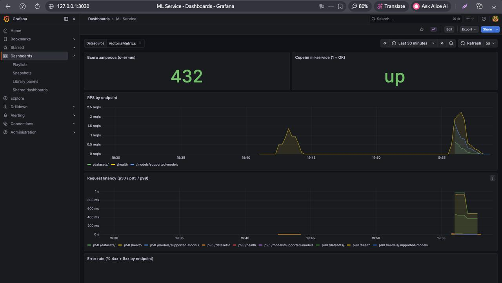
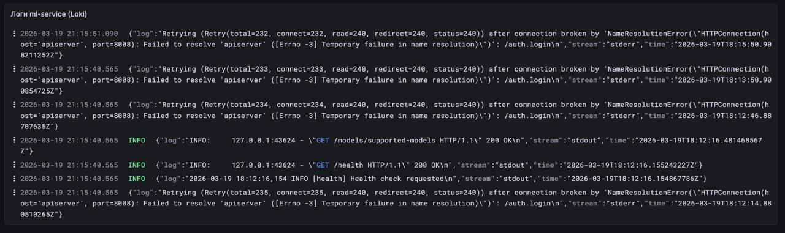

# Деплой в Minikube

## Подготовка
1. Установить Minikube
```bash
curl -LO https://storage.googleapis.com/minikube/releases/latest/minikube-linux-amd64
sudo install minikube-linux-amd64 /usr/local/bin/minikube
minikube start
```

2. Установить kubectl
```bash
curl -LO "https://dl.k8s.io/release/$(curl -L -s https://dl.k8s.io/release/stable.txt)/bin/linux/amd64/kubectl"

curl -LO "https://dl.k8s.io/release/$(curl -L -s https://dl.k8s.io/release/stable.txt)/bin/linux/amd64/kubectl.sha256"
echo "$(cat kubectl.sha256)  kubectl" | sha256sum --check

chmod +x kubectl
sudo mv kubectl /usr/local/bin/kubectl
kubectl version --client
```

## Последовательность запуска (сервис + дашборд)

### 1. Запустить Minikube и использовать его Docker

```bash
minikube start
eval $(minikube docker-env)
```

### 2. Собрать образ ML Service

```bash
docker build -t ml-service:latest -f service/Dockerfile service/
```

### 3. Применить манифесты по порядку

```bash
cd deploy
kubectl apply -f pvc.yaml -f minio.yaml -f api.yaml
```

Дождаться, пока поды `ml-service` и MinIO станут Ready (`kubectl get pods`).

```bash
kubectl apply -f victoriametrics-config.yaml -f victoriametrics.yaml
kubectl apply -f loki.yaml -f promtail.yaml
kubectl apply -f grafana-datasources.yaml -f grafana-dashboards-provider.yaml
kubectl create configmap grafana-ml-service-dashboard --from-file=ml-service.json=grafana-dashboard-ml-service.json -o yaml --dry-run=client | kubectl apply -f -
kubectl apply -f grafana.yaml
```

### 4. Открыть дашборд в браузере

``` bash
minikube service grafana --url
```

Если сервис запущен на ВМ нужно выполнить:

```bash
kubectl port-forward svc/grafana 3030:3000
kubectl port-forward svc/ml-service 8000:8000
```

Далее нужно войти в графану с логином=admin и паролем=admin

Панель **Логи ml-service (Loki)** использует datasource Loki: логи собирает **Promtail**.

Метрики


Дашборд графаны


Логи

