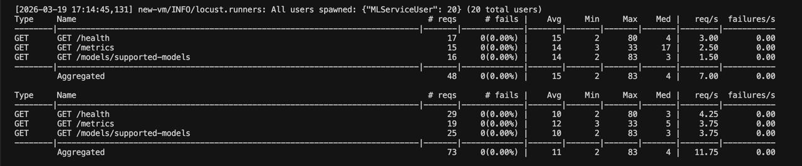
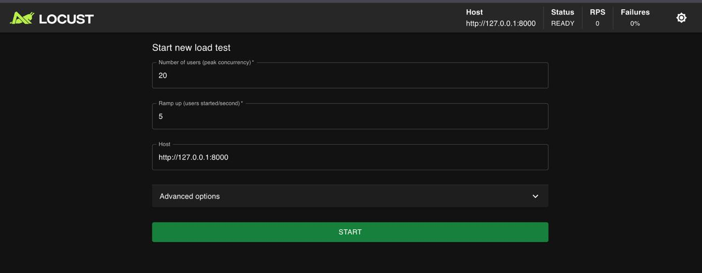

# Нагрузочное тестирование ML Service (Locust)

На Ubuntu/Debian **нельзя** ставить пакеты через `pip` в системный Python — будет ошибка **`externally-managed-environment`**. Всегда используйте **виртуальное окружение** ниже.

## Последовательность команд

Выполняйте из корня репозитория `MlService` (или скорректируйте путь к `loadtest`).

```bash
#Виртуальное окружение для Locust
cd ~/MlService/loadtest
python3 -m venv .venv
source .venv/bin/activate

pip install -r requirements-loadtest.txt

locust --host=http://127.0.0.1:8000

locust --host=http://127.0.0.1:8000 --users 20 --spawn-rate 5 --run-time 2m --headless
```
Через терминал так


В UI так


## Запуск

Базовый URL задаётся флагом `--host` (или в Web UI при первом открытии):

```bash
# Для вм kubectl port-forward svc/ml-service 8000:8000
locust --host=http://127.0.0.1:8000
```

Откройте в браузере **http://localhost:8089**: укажите параметры, стартуйте тест.

Без UI (пример — 50 пользователей, 30 с разгон, 2 минуты удержания):

```bash
locust --host=http://127.0.0.1:8000 --users 50 --spawn-rate 10 --run-time 2m --headless
```

---

## Сценарии тестирования (описание)

Ниже — **логические сценарии**, которые отражены в `locustfile.py` через веса `@task` (чем больше вес, тем чаще вызывается задача при смешанной нагрузке).

### 1. Health check (высокая доля трафика)

- **Запрос:** `GET /health`
- **Цель:** имитировать мониторинг и самый дешёвый read-path; оценить базовую задержку и стабильность при большом числе лёгких запросов.
- **Ожидания:** HTTP 200, тело с `status: ok`.

### 2. Эндпоинт метрик (средняя доля)

- **Запрос:** `GET /metrics`
- **Цель:** имитировать частый опрос Prometheus/VictoriaMetrics; ответ крупнее, чем у `/health`, выше нагрузка на сериализацию метрик.
- **Ожидания:** HTTP 200, `text/plain` с счётчиками/гистограммами.

### 3. Справочник типов моделей

- **Запрос:** `GET /models/supported-models`
- **Цель:** типичный read-only API без ClearML; проверка маршрутизации и минимальной логики.
- **Ожидания:** HTTP 200, JSON со списком имён моделей.

### 4. Список датасетов (опционально)

- **Запрос:** `GET /datasets/`
- **Цель:** нагрузка на пути с DVC/файловой системой; возможны более длинные хвосты латентности и ошибки при неготовом окружении.
- **Отключение:** `LOCUST_INCLUDE_DATASETS=0 locust ...`
- **Ожидания:** в норме 200 и JSON; при проблемах с DVC/данными — 4xx/5xx (фиксируются Locust как failure).

### 5. Список обученных моделей в ClearML (выключено по умолчанию)

- **Запрос:** `GET /models/trained-models`
- **Цель:** нагрузка на интеграцию с ClearML; имеет смысл только когда в среде доступен `apiserver` и корректные `CLEARML_*`.
- **Включение:** `LOCUST_INCLUDE_CLEARML=1 locust ...`
- **Ожидания:** HTTP 200 и список моделей; без ClearML — ошибки и рост failure rate.

### 6. Инференс predict (опционально)

- **Запрос:** `POST /models/{model}/predict` с телом `{"X": [[...], ...]}`
- **Цель:** основная **вычислительная** нагрузка и наполнение метрик **inference latency** в Prometheus/Grafana.
- **Отключение:** `LOCUST_INCLUDE_PREDICT=0 locust ...`
- **Модель:** `LOCUST_PREDICT_MODEL=linear` (или другое имя при наличии артефакта в ClearML).
- **Ожидания:** HTTP 200 и `predictions`; 404, если модели нет — в отчёте Locust помечается как failure.

---

## Рекомендуемые профили прогона

| Профиль | Пользователи | Назначение |
|--------|---------------|------------|
| Дымовой | 1–5, 30–60 с | Проверка, что сценарии не падают |
| Базовый | 20–50, 2–5 мин | Сравнение p95 латентности с SLA |
| Стресс | 100+, до отказа | Точка деградации, ошибки, таймауты |

Смотрите вкладки **Statistics**, **Charts**, **Failures** в Locust; параллельно — дашборд Grafana (RPS, latency, error rate).

---

## Вывод

**Locust** имитирует много пользователей, которые ходят по разным URL сервиса. Это удобно, чтобы понять, как API держит нагрузку, а не только «вручную нажать пару раз».

Зачем это нужно по шагам:

1. **Сверить два источника правды.** В Locust видно: сколько запросов в секунду, сколько упало, как долго отвечает. В Grafana — те же вещи через метрики. Если цифры в целом похожи, значит, мониторинг и реальная нагрузка согласованы.

2. **Понять, что тормозит.** Простые запросы вроде `/health` должны отвечать быстро. Тяжёлые — например **`predict`** (считает модель) или запросы к датасетам / ClearML — могут быть медленнее или чаще падать. Так видно, проблема в самом API или во внешних сервисах.

3. **Включать сценарии по необходимости.** Можно отключить предсказания и ClearML — тогда нагрузка «лёгкая», удобно для проверки «жив ли сервис». Если включить **`predict`** и датасеты — картина ближе к боевой, плюс на дашборде появятся метрики по времени инференса.

**Коротко:** мало ошибок в Locust, ответы не сильно «растягиваются» по времени, на графиках в Grafana нет всплеска ошибок — под такой нагрузкой всё нормально. Если ошибок стало больше или ответы резко замедлились — смотрите **логи** (например, в Loki), хватает ли **памяти/CPU** у пода и не отвалились ли **MinIO, ClearML, DVC**.
